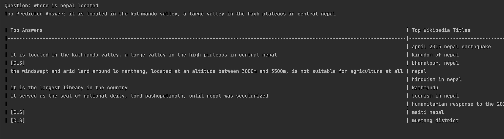
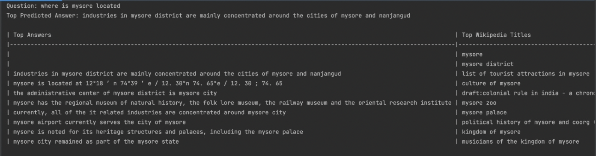

# Open_Domain_Question_Answering_Agent-ODQA-
This repository consists of ODQA implementation used for MSc Artificial Intelligence Masters Project in Heriot-Watt-University 

## Introduction

This is the Pytorch Re-implementation of DrQA model described in the paper: [Reading Wikipedia to Answer Open-Domain Questions](https://arxiv.org/abs/1704.00051) 
and fine-tuning of BERT-base as described in the paper: [End-to-End Open-Domain Question Answering with BERTserini](https://arxiv.org/abs/1902.01718).

The goal of this project is to implement an End-to-end open domain Question Answering system (ODQA) for any factoid question using Wikipedia as the unique knowledge source. 
This task of large scale machine reading is combined with the challenges of document retrieval (finding the relevant articles from Wikipedia )
and machine comprehension of text (locating the answer spans from those articles). For a given question, this project consists of two
components: (1) Information Retrieval System to extract relevant documents among the collection of more than 6 million Wikipedia articles and (2) Machine Reading Comprehension
to scan the retrieved documents to find the answer. Lastly, the performance of both components are assessed individually using the intrinsic evaluation metrics.

## Quick Demo of interactive Session

For interactive Session as illustrated bellow, run the __interactive__.py file. In the example, Top Predicted answer is
the algorithm that selects the best answers among the top listed Answers displayed in the table. 

```bash
__interactive__.py
```
Example 1:


Example 2:


## Datasets 
In this project, English Wikipedia serves as a knowledge source for finding answers which is nearly 89 GB after extracting. 
SQuAD V1.0 & V2.0 is used to train the language models. After downloading these dataset, please place in the dataset folder

The latest English Wikipedia dump can be found: [English Wikipedia Dump](https://dumps.wikimedia.org/enwiki/20220501/)

The SQuAD dataset can be downloaded: [SQuAD V 1.0 & V2.0](https://rajpurkar.github.io/SQuAD-explorer/)

## Installaiton 

Installation is simple. This project requires Linux/OSX and Python 3.5 or higher. It also requires installing PyTorch version >= 1.0.0. 
The repo is tested on Python 3.10, Cuda 10.1, PyTorch 1.5.1 on Tesla P100 GPUs. Besides that, conda is recommended for convinence.

Download  SQuAD datafiles, GloVe word vectors, Transformers and other dependencies listed in requirements.txt. 

CUDA is necessary to train the models.

Run the following commands to clone the repository:

```bash
git clone git@github.com:shreyasarunesh/Open_Domain_Question_Answering_Agent-ODQA-.git
cd Open_Domain_Question_Answering_Agent-ODQA-; pip install -r requirements.txt; 
```

The repository looks like the bellow format. 
```
Open_Domain_Question_Answering_Agent-ODQA-
├── Retriever
         ├── WikiIndexing
                ├── __main__.py
                ├── CreateIndex.py
                ├── DataWriter.py
                ├── MergeFiles.py
                ├── PageProcessor.py
                ├── SaxParcer.py
                ├── TextPreProcessor.py           
         ├── WikiSearching
                 ├── __main__.py
                 ├── BM25.py
                 ├── FileTraverser.py 
                 ├── QueryResults.py 
                 ├── RunQuery.py      
        ├── Evaluation
                 ├── Evaluation.py
├── Reader
        ├── BERT.py
        ├── DrQA.py
        ├── Eval_metrics.py
        ├── Preprocessing.py
├── Reader_model_output
        ├── BERT_finetuned_model_on_SQuAD_V 1.0
                    ├── config.json pytorch_model.bin
                    ├── pytorch_model.bin
        ├── BERT_finetuned_model_on_SQuAD_V 2.0
                    ├── config.json pytorch_model.bin
                    ├── pytorch_model.bin
        ├── DrQA_trained_SQuAD-1.pth
        ├── DrQA_trained_SQuAD-2.pthenglish_wiki_index
├── Dataset
        ├── english_wikipedia_Dump
        ├── squad1.0
        ├── squad2.1
        ├── output_data
                ├── english_wiki_index
        
``

## Results

The table bellow illustrates the results of both models in this project and State-of-the-art models.

|-------------------------------|-------------------|----------------------|
|  Models                       |    SQuAD V1.0     |     SQuAD V2.0       |
|-------------------------------|-------------------|----------------------|
|                               | F1-Score  | EM    | F1-Score  |   EM     |
|-------------------------------|-------------------|----------------------|
|    DrQA Original              | 78.83     | 69.51 | --        |   --     |
|      BiDAF                    | 81.12     | 73.31 | --        |   --     |
|**DrQA - (This project)**      | 57.53     | 42.33 | 50.12     |   43.54  |
|-------------------------------|-------------------|----------------------|
|                               | F1-Score  | EM    | F1-Score  |   EM     |
|-------------------------------|-------------------|----------------------|
|  BERT-Serini                  | 46.1      | 38.6  | --        |   --     |
|BERT-base-Original             | 88.50     | 81.20 | 75.73     | 72.35    |
|BERT-large-Original            | 91.28     | 84.32 | 80.23     |   83.00  |
| Distil-BERT-Original          | 85.8      | 77.7  | 68.1      |   64.88  |
|   T5- base                    |  85.71    | 76.95 | 81.2      |   77.64  |
| **BERT-base (This project)**  | 73.27     | 66.66 | 68.42     |   64.16  |
|-------------------------------|-------------------|----------------------|

## Author

- [@Shreyas Arunesh](https://github.com/shreyasarunesh)

